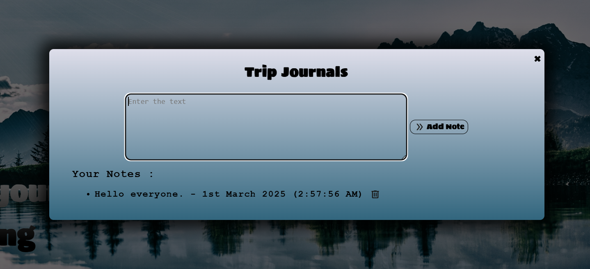
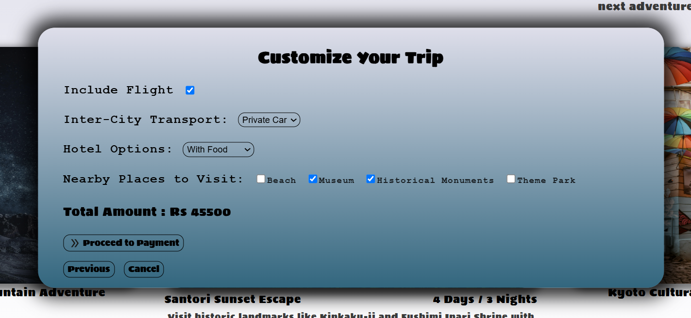
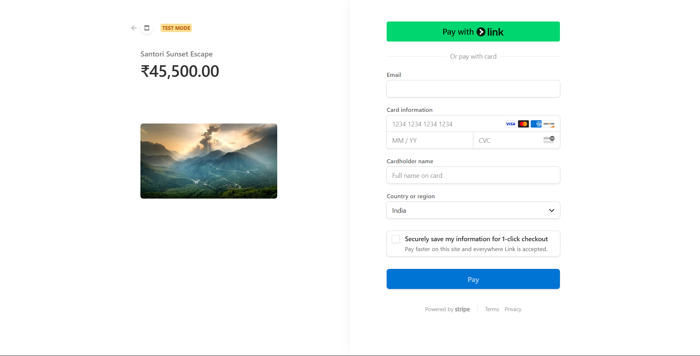

# ✈️ CI/CD Holiday Itinerary Platform 🌍

## 🌟 Project Overview
The **Holiday Itinerary Preparation Platform** is a smart travel planning solution designed to make trip organization effortless. With personalized recommendations, automated itinerary generation, budget planning, real-time updates, and seamless collaboration, it enhances every traveler’s experience. The platform also includes features like offline access, user reviews, and social sharing for a hassle-free journey! 🏝️📅

## 🎯 Aim
To develop an intelligent travel planning platform that leverages technology to create efficient, personalized, and enjoyable trip itineraries while offering real-time updates, budget management, and collaboration features. 🏕️🗺️

## 🚀 Features
### 🏖️ 1. Personalized Destination Recommendations
- 🤖 Uses AI to suggest destinations based on user preferences, past travel history, and budget.
- 🌍 Provides curated recommendations for adventure, relaxation, cultural exploration, and family-friendly trips.
- 🌐 Supports multiple languages for a global audience.

### 📆 2. Automated Itinerary Generation
- 🏨 Automatically plans accommodation, sightseeing, dining, and transportation.
- ✏️ Allows users to customize their itinerary easily.
- 🗺️ Integrates with maps for real-time navigation.

### 💰 3. Budget Planning and Management
- 💳 Helps users track travel expenses.
- 🏷️ Estimates costs for hotels, transport, meals, and activities.
- 📢 Sends alerts when expenses approach budget limits.

### ⛅ 4. Real-Time Weather Updates and Local Travel Suggestions
- 🌦️ Provides live weather updates for chosen destinations.
- 🍽️ Recommends must-visit attractions, dining spots, and cultural experiences.
- 🚖 Suggests the best local transportation options.

### 🛂 5. Travel Document Management and Emergency Assistance
- 🔐 Securely stores passports, visas, and insurance details.
- 🚑 Provides access to emergency contacts, medical facilities, and embassies.
- ⚠️ Sends real-time safety alerts and updates.

## 🛠️ Technologies Used
- 🎨 **Frontend**: React.js
- 💻 **Backend**: Node.js, Express.js
- 🗄️ **Database**: MongoDB
- 🔄 **CI/CD**: GitHub Actions
- 🌍 **APIs**: Google Maps API, OpenWeather API, Currency Exchange API

## 👨‍💻 Contributors
- **Shayaree Lodh** - 22BBS0024 🎒
- **Aakarsh Agarwal** - 22BBS0179 🌎
- **Pritidisha Samal** - 22BBS0188 🏔️
- **Nandipati Jahnika** - 22BBS0192 🛫
- **Samarth Patel** - 22BBS0196 🏕️
- **Nikita Anandmani** - 22BBS0202 🚀

## 📚 Guided and Mentored by:
**Prof. Senthilnathan (SCOPE)** 📖  
Course: IT Project Management (CBS3012) 🎓

## Few ScreenShots:

